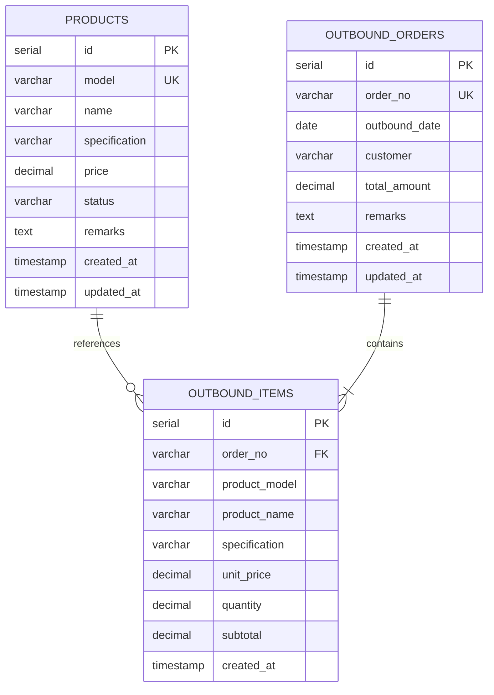

# 数据库设计文档

## 概述

简易出库系统使用 PostgreSQL 数据库，采用关系型数据库设计，包含产品管理、出库单管理和统计分析功能。

## 数据库 ER 图



## 表结构详细说明

### 1. 产品表 (products)

存储产品基本信息。

| 字段名 | 类型 | 约束 | 说明 |
|--------|------|------|------|
| id | SERIAL | PRIMARY KEY | 产品ID（主键） |
| model | VARCHAR(50) | UNIQUE NOT NULL | 产品型号（唯一） |
| name | VARCHAR(100) | NOT NULL | 产品名称 |
| specification | VARCHAR(50) | NOT NULL | 规格/单位 |
| price | DECIMAL(10,2) | NOT NULL CHECK >= 0 | 价格 |
| status | VARCHAR(20) | DEFAULT 'active' | 状态：active-启用, inactive-停用 |
| remarks | TEXT | | 备注 |
| created_at | TIMESTAMP | DEFAULT CURRENT_TIMESTAMP | 创建时间 |
| updated_at | TIMESTAMP | DEFAULT CURRENT_TIMESTAMP | 更新时间 |

**索引：**
- `idx_products_model` - 产品型号索引
- `idx_products_name` - 产品名称索引
- `idx_products_status` - 状态索引
- `idx_products_created_at` - 创建时间索引

**触发器：**
- `update_products_updated_at` - 自动更新 updated_at 字段

### 2. 出库单主表 (outbound_orders)

存储出库单基本信息。

| 字段名 | 类型 | 约束 | 说明 |
|--------|------|------|------|
| id | SERIAL | PRIMARY KEY | 出库单ID（主键） |
| order_no | VARCHAR(50) | UNIQUE NOT NULL | 出库单号（唯一），格式：OUT20251211001 |
| outbound_date | DATE | NOT NULL | 出库日期 |
| customer | VARCHAR(100) | | 客户名称 |
| total_amount | DECIMAL(10,2) | DEFAULT 0 CHECK >= 0 | 总计金额 |
| remarks | TEXT | | 备注 |
| created_at | TIMESTAMP | DEFAULT CURRENT_TIMESTAMP | 创建时间 |
| updated_at | TIMESTAMP | DEFAULT CURRENT_TIMESTAMP | 更新时间 |

**索引：**
- `idx_outbound_orders_order_no` - 出库单号唯一索引
- `idx_outbound_orders_date` - 出库日期降序索引
- `idx_outbound_orders_customer` - 客户名称索引
- `idx_outbound_orders_created_at` - 创建时间降序索引

**触发器：**
- `update_outbound_orders_updated_at` - 自动更新 updated_at 字段

### 3. 出库单明细表 (outbound_items)

存储出库单的产品明细信息。

| 字段名 | 类型 | 约束 | 说明 |
|--------|------|------|------|
| id | SERIAL | PRIMARY KEY | 明细ID（主键） |
| order_no | VARCHAR(50) | NOT NULL FK | 出库单号（外键） |
| product_model | VARCHAR(50) | NOT NULL | 产品型号 |
| product_name | VARCHAR(100) | NOT NULL | 产品名称（冗余存储） |
| specification | VARCHAR(50) | NOT NULL | 规格（冗余存储） |
| unit_price | DECIMAL(10,2) | NOT NULL CHECK >= 0 | 单价（历史价格快照） |
| quantity | DECIMAL(10,2) | NOT NULL CHECK > 0 | 数量 |
| subtotal | DECIMAL(10,2) | NOT NULL CHECK >= 0 | 小计 |
| created_at | TIMESTAMP | DEFAULT CURRENT_TIMESTAMP | 创建时间 |

**外键约束：**
- `order_no` REFERENCES `outbound_orders(order_no)` ON DELETE CASCADE

**索引：**
- `idx_outbound_items_order_no` - 出库单号索引
- `idx_outbound_items_product_model` - 产品型号索引
- `idx_outbound_items_created_at` - 创建时间索引

## 视图

### 1. 出库记录汇总视图 (v_outbound_summary)

```sql
SELECT 
    oo.order_no,
    oo.outbound_date,
    oo.customer,
    oo.total_amount,
    oo.remarks,
    COUNT(oi.id) AS item_count,
    SUM(oi.quantity) AS total_quantity,
    oo.created_at,
    oo.updated_at
FROM outbound_orders oo
LEFT JOIN outbound_items oi ON oo.order_no = oi.order_no
GROUP BY oo.order_no, ...
```

### 2. 产品出库统计视图 (v_product_outbound_stats)

```sql
SELECT 
    p.model,
    p.name,
    p.specification,
    p.price AS current_price,
    COALESCE(SUM(oi.quantity), 0) AS total_quantity,
    COALESCE(SUM(oi.subtotal), 0) AS total_amount,
    COALESCE(COUNT(DISTINCT oi.order_no), 0) AS order_count,
    MAX(oi.created_at) AS last_outbound_date
FROM products p
LEFT JOIN outbound_items oi ON p.model = oi.product_model
WHERE p.status = 'active'
GROUP BY p.model, ...
```

## 函数和存储过程

### 1. 自动更新时间戳 (update_updated_at_column)

触发器函数，自动更新 `updated_at` 字段为当前时间。

```sql
CREATE OR REPLACE FUNCTION update_updated_at_column()
RETURNS TRIGGER AS $$
BEGIN
    NEW.updated_at = CURRENT_TIMESTAMP;
    RETURN NEW;
END;
$$ LANGUAGE plpgsql;
```

### 2. 生成出库单号 (generate_order_no)

自动生成出库单号，格式：OUT + YYYYMMDD + 3位流水号。

```sql
CREATE OR REPLACE FUNCTION generate_order_no()
RETURNS VARCHAR AS $$
DECLARE
    today_date VARCHAR(8);
    seq_num INTEGER;
    new_order_no VARCHAR(50);
BEGIN
    today_date := TO_CHAR(CURRENT_DATE, 'YYYYMMDD');
    SELECT COALESCE(MAX(CAST(SUBSTRING(order_no FROM 12 FOR 3) AS INTEGER)), 0) + 1
    INTO seq_num
    FROM outbound_orders
    WHERE order_no LIKE 'OUT' || today_date || '%';
    new_order_no := 'OUT' || today_date || LPAD(seq_num::TEXT, 3, '0');
    RETURN new_order_no;
END;
$$ LANGUAGE plpgsql;
```

## 数据约束

### 业务规则

1. **产品型号唯一性**：每个产品型号在系统中必须唯一
2. **出库单号唯一性**：出库单号自动生成且唯一
3. **价格非负**：产品价格和出库单金额不能为负数
4. **数量正数**：出库数量必须大于0
5. **历史价格快照**：出库明细中保存创建时的价格，产品价格变更不影响历史记录
6. **级联删除**：删除出库单时，自动删除所有明细

### 数据完整性

1. **外键约束**：出库明细的 order_no 必须存在于出库单主表
2. **级联操作**：DELETE CASCADE 确保数据一致性
3. **CHECK 约束**：确保价格和数量的合法性

## 性能优化

### 索引策略

1. **主键索引**：所有表的 id 字段自动创建主键索引
2. **唯一索引**：产品型号、出库单号创建唯一索引
3. **查询索引**：
   - 日期字段（降序）：支持按时间倒序查询
   - 外键字段：提高关联查询性能
   - 搜索字段：产品名称、客户名称

### 查询优化建议

1. 使用日期范围查询时，利用 `idx_outbound_orders_date` 索引
2. 产品搜索使用 ILIKE 时，建议使用 pg_trgm 扩展提升性能
3. 统计查询可以使用视图简化 SQL
4. 大数据量时考虑分区表（按年份或季度）

## 备份和恢复

### 备份策略

```bash
# 完整备份
pg_dump -h localhost -U postgres -d outbound_system > backup.sql

# 仅备份数据
pg_dump -h localhost -U postgres -d outbound_system --data-only > data_backup.sql

# 仅备份结构
pg_dump -h localhost -U postgres -d outbound_system --schema-only > schema_backup.sql
```

### 恢复策略

```bash
# 恢复数据库
psql -h localhost -U postgres -d outbound_system < backup.sql
```

## 数据字典

### 产品状态 (product.status)

| 值 | 说明 |
|----|------|
| active | 启用 - 产品可用于出库 |
| inactive | 停用 - 产品不可用于新出库单 |

### 出库单号格式 (outbound_orders.order_no)

**格式**：`OUT` + `YYYYMMDD` + `NNN`

**示例**：
- `OUT20251211001` - 2025年12月11日第1个出库单
- `OUT20251211002` - 2025年12月11日第2个出库单

**说明**：
- 前3位：固定前缀 "OUT"
- 中间8位：日期（年月日）
- 后3位：当天的流水号（001-999）

## 维护建议

1. **定期清理**：定期归档历史数据（如1年以前的出库单）
2. **索引维护**：定期执行 VACUUM 和 ANALYZE
3. **监控慢查询**：使用 pg_stat_statements 监控查询性能
4. **容量规划**：监控表大小，及时扩容

## 安全建议

1. **最小权限原则**：应用程序使用专用数据库用户，仅授予必要权限
2. **参数化查询**：防止 SQL 注入攻击
3. **备份加密**：备份文件应加密存储
4. **审计日志**：记录重要操作的审计日志
